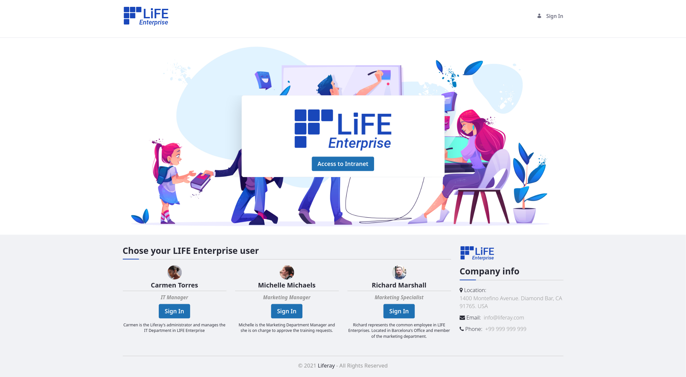
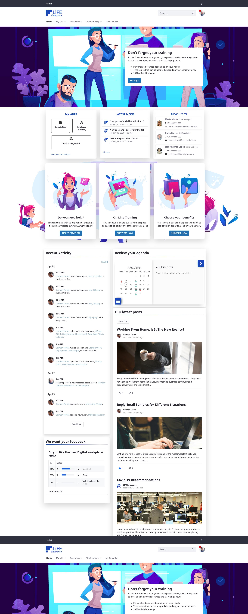
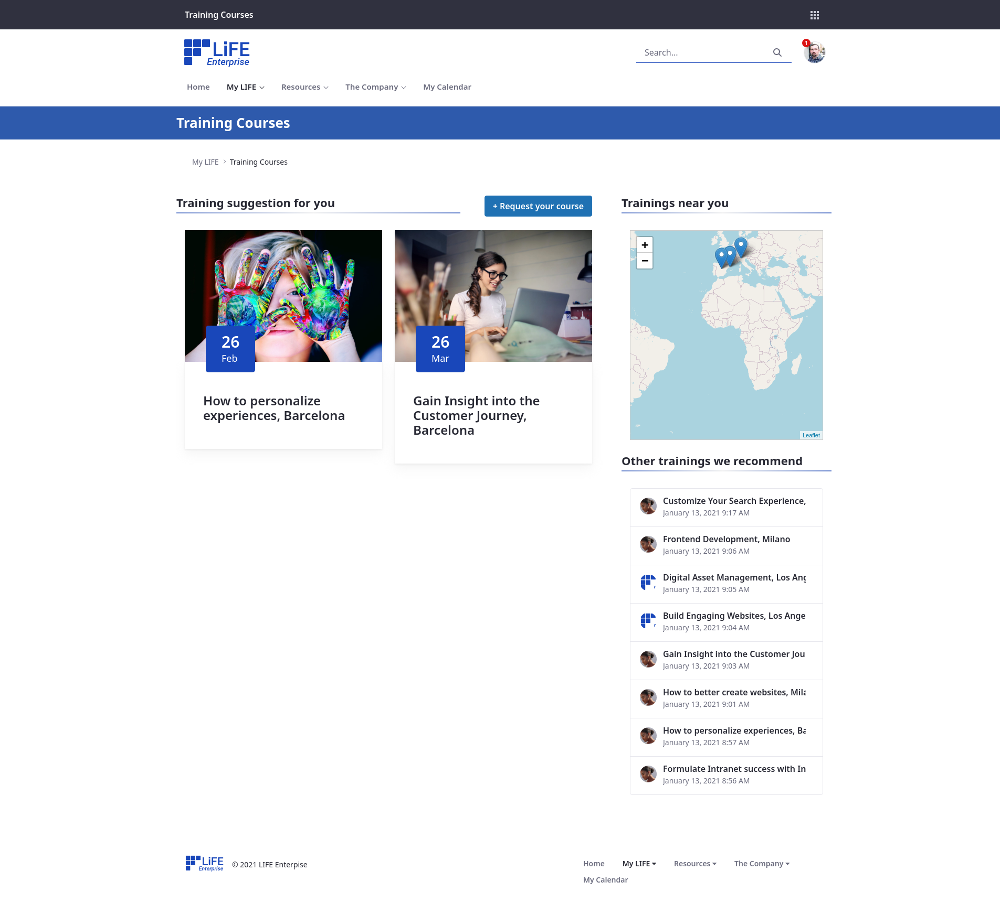

[![Contributors][contributors-shield]][contributors-url]
[![Forks][forks-shield]][forks-url]
[![Stargazers][stars-shield]][stars-url]
[![Issues][issues-shield]][issues-url]
![GitHub top language][top-lenguage-shield]
[![LinkedIn][linkedin-shield]][linkedin-url]

# Modern Intranet Demo
LIFE Enterprise (Modern-intranet) 7.3 Demo stack

## Getting Started

### Requirements

- Docker 19+

### Software Stack
* Liferay DXP 7.3.10.1 SP1
* MySQL 8.0

### Instructions
* Restore the database in your local environment. 
    * The included dump is compatible with MySQL 5.7 and MariaDB
    * Note that the database is named `demo_intranet7.3`
* Complete the configuration in portal-ext.properties with you local configuration.
* Run Liferay **docker-compose up -d**  and Log in as an admin
* Go to Control Panel > Search > Index Actions: **Reindex all search indexes**
* Go to Control Panel > Gogo Shell and execute: **upgrade:execute com.liferay.analytics.settings.web** to upgrade the AC Web module (https://issues.liferay.com/browse/LRAC-7705)

### Explore

Play with Liferay at http://localhost:8080 and deploy your applications under `./liferay/deploy`.

#### Credentials
| **User** | **Role** | **Mail Address** | **Password** |
|----------|----------|------------------|--------------|
| Admin | Admin | admin@lifeenterprise.com | Liferay321=0! |
| Carmen Torres | Admin and IT Manager | carmen.torres@lifeenterprise.com | liferay$ |
| Richard Marshal | Marketing Specialist | richard.marshall@lifeenterprise.com | liferay$ |
| Michelle Michaels | Marketing Manager | michelle.michaels@lifeenterprise.com | liferay$ |
| Maria Montes | HR Manager | maria.montes@lifeenterprise.com | liferay$ |

#### Script
https://docs.google.com/document/d/1etDOe_lFLvEeZNJvMaX_QR8alWJb2NJb6w4RovHp58I/edit?usp=sharing

### Known issues
* ERROR: Unable to get portlet com_liferay_app_builder_web_internal_portlet_ProductMenuAppPortlet_277546site for panel app com.liferay.app.builder.web.internal.application.list.ProductMenuPanelApp
* WARNING: Unable to register portal instance {mvccVersion=3, companyId=20097, accountId=20100, webId=lifeenterprise.com, mx=lifeenterprise.com, homeURL=/web/intranet, logoId=57110, system=false, maxUsers=0, active=true}

## Screenshots
### Public Site

### Home Page

### Training Portal

### Organization Chart

<!-- MARKDOWN LINKS & IMAGES -->
[contributors-shield]: https://img.shields.io/github/contributors/martin-dominguez/liferay-modules.svg
[contributors-url]: https://github.com/martin-dominguez/liferay-modules/graphs/contributors
[forks-shield]: https://img.shields.io/github/forks/martin-dominguez/liferay-modules.svg
[forks-url]: https://github.com/martin-dominguez/liferay-modules/network/members
[stars-shield]: https://img.shields.io/github/stars/martin-dominguez/liferay-modules.svg
[stars-url]: https://github.com/martin-dominguez/liferay-modules/stargazers
[issues-shield]: https://img.shields.io/github/issues/martin-dominguez/liferay-modules.svg
[issues-url]: https://github.com/martin-dominguez/liferay-modules/issues
[top-lenguage-shield]: https://img.shields.io/github/languages/top/martin-dominguez/liferay-modules
[linkedin-shield]: https://img.shields.io/badge/-LinkedIn-black.svg?logo=linkedin&colorB=555
[linkedin-url]: https://linkedin.com/in/-martin-dominguez/
